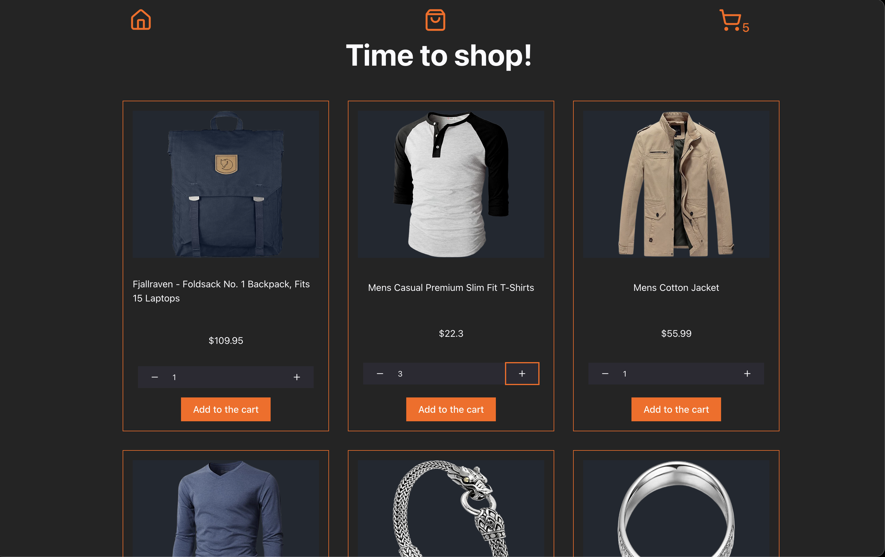
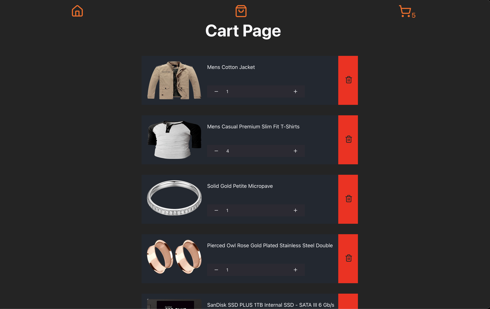

# Shopping Cart

This project is meant to practice some Fronted fundamental concepts in the React world, such as:

- Client Routing using React Router.
- Testing React apps.
- Styling React apps.
- Components life cycle.
- Fetching data in React.
- Deploying React apps.

Project is online on vercel here [Shopping Cart](https://shopping-cart-two-gold.vercel.app/home)

## How to install

First fork the repo, if you don't know how to do that check out Github Docs on [Working with Forks](https://docs.github.com/en/pull-requests/collaborating-with-pull-requests/working-with-forks/fork-a-repo)

After you forked the repo, go to new the folder created (should be `shopping-cart/`)

The only thing left is to run the project.
To do that, we're going to run in the terminal
(make sure you're in the same directory):

`npm create vite@latest . -- --template react`

This will create a vite React template on the folder you're currently in.

Now you can go to `http://localhost:5173/` in your browser to see the app

## Screenshots

